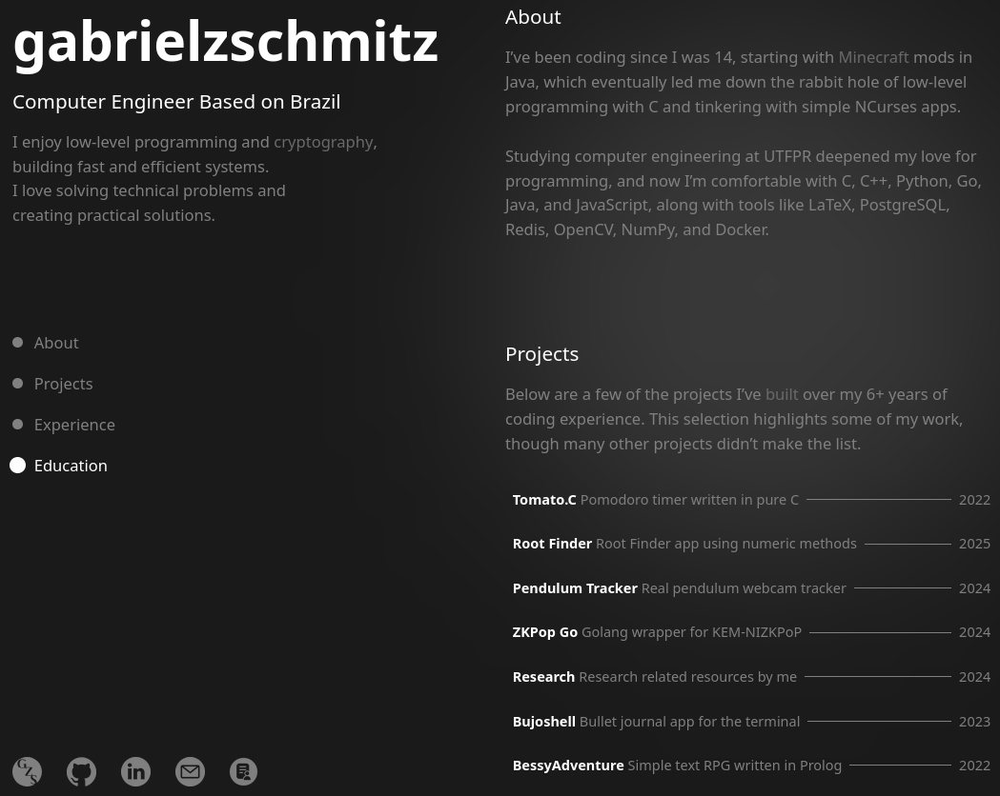
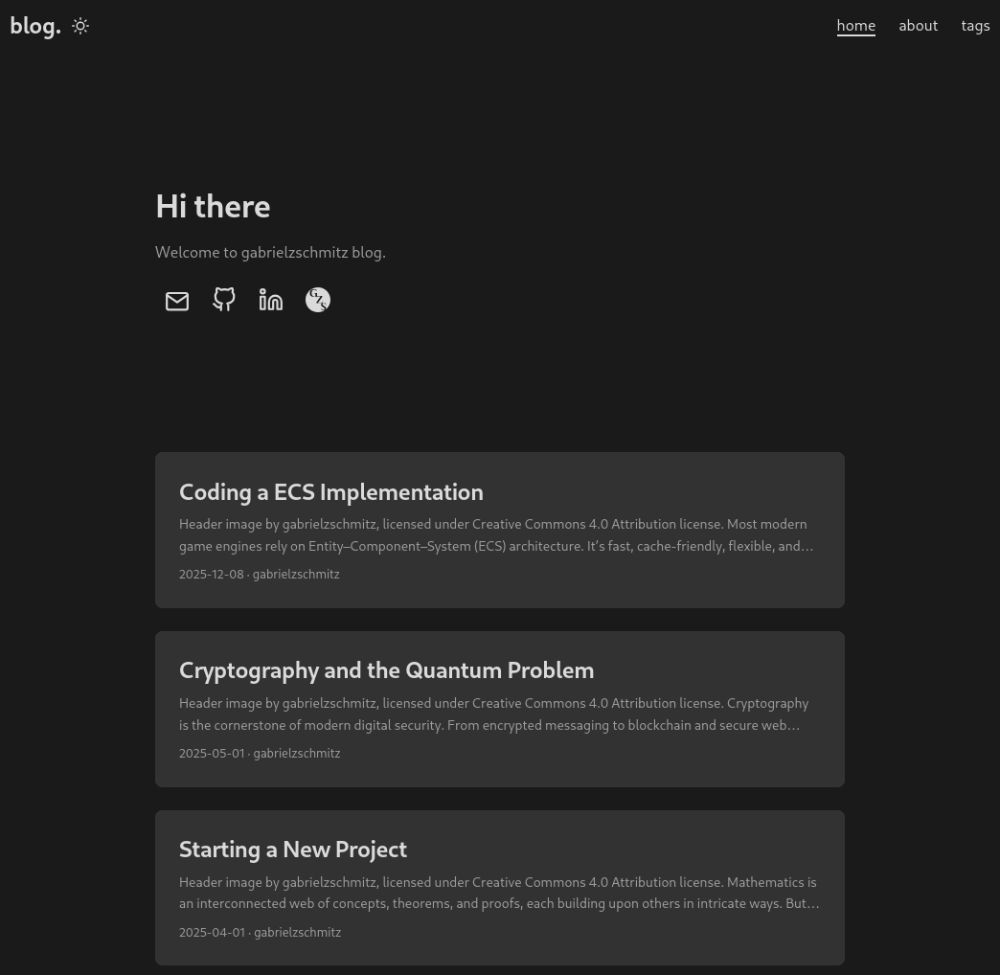

# Personal Website

This repository contains the full source code for my personal website. It
brings together a **handcrafted static landing page** at `/` --- built entirely
with HTML, CSS, and JavaScript --- and a **[Hugo](https://gohugo.io/)-powered
blog** served at `/blog`, where all long-form writing and technical posts live.
The project blends a lightweight custom front page with Hugo’s fast, flexible
content system, allowing the site to function both as a portfolio and as a
structured blogging platform.

## Overview

* **Landing Page (`/`)**

  * Handcrafted using **HTML**, **CSS**, and **JavaScript**
  * Lives directly in the root (`index.html`, plus `css/`, `js/`, `images/`, etc.)

    

* **Blog (`/blog`)**

  * Built with **Hugo**
  * Markdown posts in `content/`
  * Themes in `themes/`
  * Build output in `public/`
  * Configured via `hugo.toml`

    

* **Extras**

  * Resume (`resume.pdf`, `curriculo.pdf`)
  * Certificates (`certificates/`)
  * Under-construction page

## License

This project is licensed under the MIT License, but the images are licensed
under the Creative Commons Attribution 4.0 License. See the [LICENSE](LICENSE)
file
for details.
