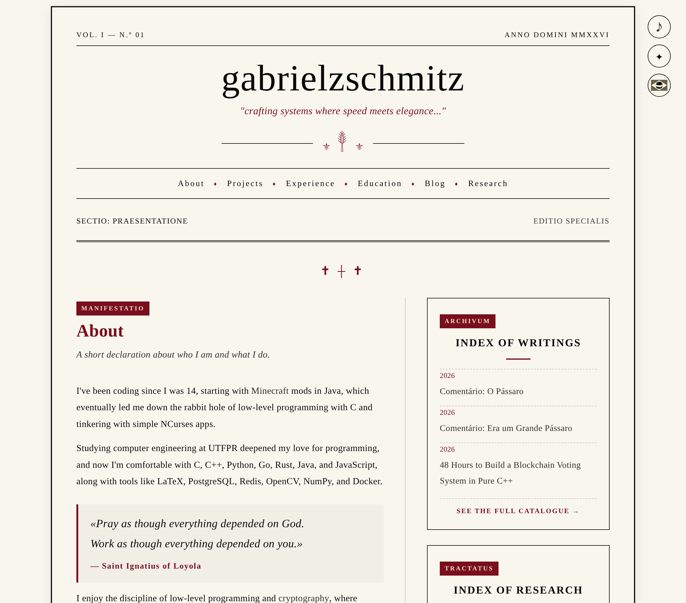
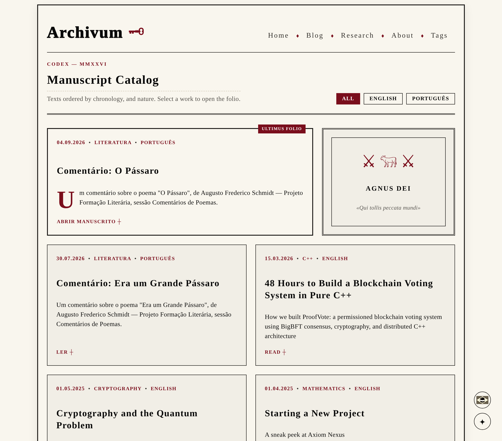

# Personal Website


<a href="./LICENSE"></a>
<a href="https://www.buymeacoffee.com/gabrielzschmitz" target="_blank"></a>
<a href="https://github.com/gabrielzschmitz/gabrielzschmitz-website"></a>

This repository contains the full source code for my personal website. It is
built as a single [Zola](https://www.getzola.org/) site with
[BibInject](https://github.com/gabrielzschmitz/BibInject) for bibliography
injection, serving both the handcrafted _portfolio main page_ at `/` and the
_blog_ at `/blog`, where all long-form writing posts live.

## Overview


### Main Page (`/`)

<p align="center">
    
</p>


### Blog (`/blog`)

<p align="center">
    
</p>

## Build

The site is built with **[Zola](https://www.getzola.org/)** and research
references are injected at build time by
**[BibInject](https://github.com/gabrielzschmitz/BibInject)**.

### Requirements

- **Zola**: used to build the documentation site.
- **Python 3 with `venv`**: used by
  [BibInject](https://github.com/gabrielzschmitz/BibInject) to manage its
  virtual environment.

<details>
<summary>Install dependencies</summary>

#### Arch Linux

```bash
sudo pacman -S python zola
```

#### Ubuntu / Debian

```bash
sudo apt update
sudo apt install python3 python3-venv zola
```

> On older Ubuntu/Debian releases, `zola` may not be available in the default
> repositories. In that case, install Zola separately from its official
> releases.

#### Alpine Linux

```bash
sudo apk add python3 py3-virtualenv zola
```

#### macOS

Using [Homebrew](https://brew.sh/):

```bash
brew install python zola
```

</details>

### Production

```sh
./build.sh
```

Builds the site with Zola and injects the research references. Output:
`./public`.

### Development

```sh
./build.sh --serve
```

Watches for changes, rebuilds automatically, and serves locally on port `1111`.

### BibInject

[BibInject](https://github.com/gabrielzschmitz/BibInject) is downloaded from
its pinned GitHub release into a cache directory . Each build updates its
`mini` refspec with the repo's `static/refspec/mini.html` to keep the sidebar
layout in sync.

## License

This project is licensed under the MIT License, but the images are licensed
under the Creative Commons Attribution 4.0 License. See the [LICENSE](LICENSE)
file
for details.
