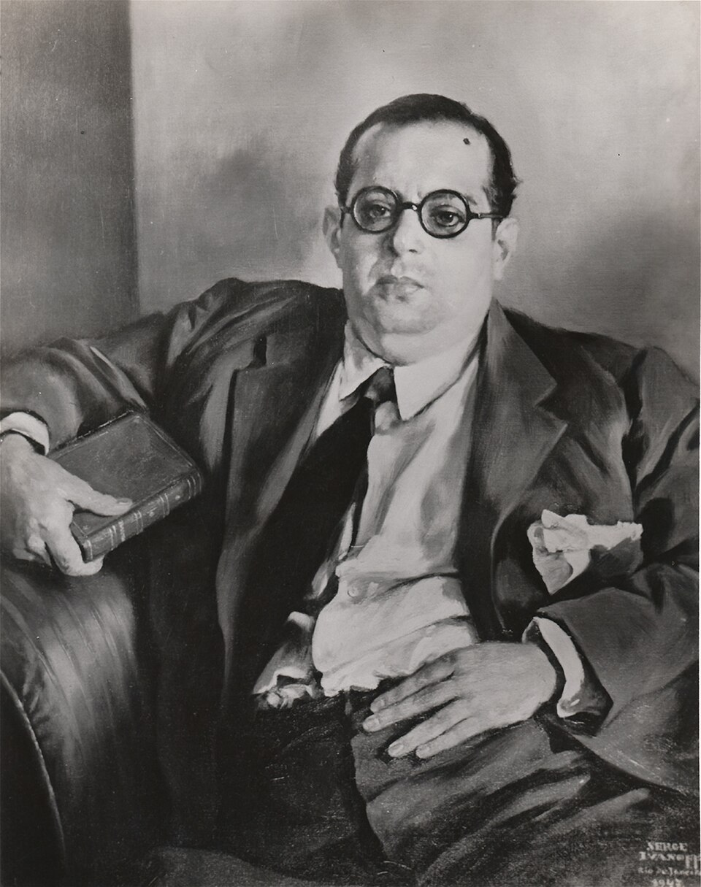
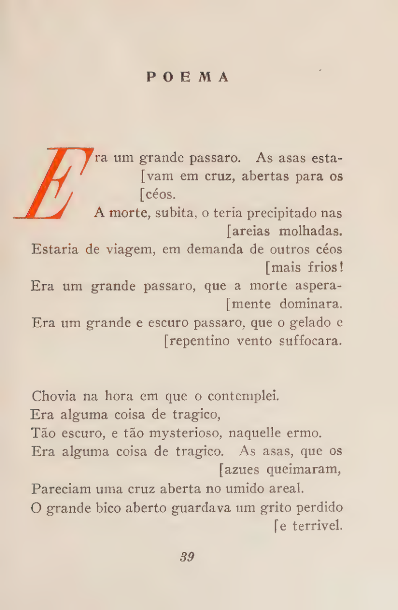

+++
title = "Comentário: Era um Grande Pássaro"
description = "Um comentário sobre o poema \"Era um Grande Pássaro\", de Augusto Frederico Schmidt — Projeto Formação Literária, sessão Comentários de Poemas."
date = 2026-07-30
aliases = ["era-um-grande-passaro"]

[taxonomies]
tags = ["Literatura", "Poesia", "Augusto Frederico Schmidt",
"Formação Literária", "Comentários de Poemas", "Poesia Brasileira"]

[extra]
author = ["gabrielzschmitz"]
language = "Português"
hero = "header.svg"
hero_caption = " Imagem do cabeçalho por <a href=\"https://gabrielzschmitz.xyz\">gabrielzschmitz</a>, licenciada sob a <a href=\"https://creativecommons.org/licenses/by/4.0/\">licença Creative Commons 4.0 Atribuição</a>."
+++

 

Este texto integra a sessão _Comentários de Poemas_ do projeto [*Formação
Literária*](https://github.com/gabrielzschmitz/flit) e discute o poema **Era um
Grande Pássaro**, de **Augusto Frederico Schmidt** (1906--1965). A versão em
LaTeX, com todo o material-fonte do estudo, está disponível em
[comentarios-poemas/era-um-grande-passaro](https://github.com/gabrielzschmitz/flit/tree/main/comentarios-poemas/era-um-grande-passaro).

---

## Sobre o Autor

<em>Augusto Frederico Schmidt (1906–1965).</em>

Augusto Frederico Schmidt (Rio de Janeiro, 18 de
abril de 1906 -- Rio de Janeiro, 8 de fevereiro de 1965) foi poeta, editor,
empresário, diplomata e homem público brasileiro. Filho de um imigrante judeu
asquenaze alemão e neto do Visconde de Schmidt, iniciou sua trajetória no
mercado editorial após atuar na Livraria Católica e, em 1930, fundou a Livraria
Schmidt Editora.

À frente da editora, publicou as primeiras obras de autores que se tornariam
fundamentais para a literatura brasileira, entre eles Gilberto Freyre,
Graciliano Ramos, Rachel de Queiroz, Jorge Amado, Vinicius de Moraes, Lúcio
Cardoso e Octávio de Faria. A Livraria Schmidt tornou-se um dos principais
centros da vida intelectual carioca na década de 1930, servindo como ponto de
encontro do chamado *Círculo Católico*, grupo informal que reunia escritores,
jornalistas e pensadores ligados ao renascimento do pensamento católico no
Brasil na época.

Paralelamente à atividade literária, desenvolveu uma carreira de sucesso como
empresário, atuando nos setores editorial, de seguros, mineração, aviação e
varejo. Também exerceu funções diplomáticas e foi assessor especial do
presidente Juscelino Kubitschek, sendo tradicionalmente associado à criação do
slogan "50 anos em 5". Faleceu no Rio de Janeiro em 1965, deixando uma obra
poética que permanece entre as mais singulares da literatura brasileira do
século XX.

---

## Por que este poema?

A escolha de *Era Um Grande Pássaro* parte da
convicção de que Augusto Frederico Schmidt ocupa um lugar muito mais elevado na
literatura brasileira do que aquele que lhe é normalmente atribuído. Figura
central da vida intelectual das décadas de 1930 e 1940, editor responsável pela
publicação de alguns dos mais importantes escritores brasileiros e autor de uma
obra poética singular, Schmidt acabou gradualmente relegado a uma posição
secundária na historiografia literária.

Seu relativo esquecimento decorre, em grande parte, da combinação de fatores
estéticos e ideológicos. Enquanto a crítica passou a privilegiar uma poesia
cada vez mais identificada com o experimentalismo modernista, Schmidt manteve
uma escrita marcada pela espiritualidade, pelo simbolismo, pela musicalidade e
pela permanência de formas clássicas. Sua declarada identidade católica e sua
participação na articulação inicial do integralismo brasileiro também
contribuíram para que sua obra fosse frequentemente lida à luz de suas posições
políticas, em detrimento de seus méritos literários.

Essa tensão já era perceptível em sua própria época. A conhecida crítica de
Mário de Andrade ilustra o desencontro entre dois projetos estéticos e
intelectuais distintos. Como observa Leandro Garcia Rodrigues, enquanto Mário
propunha uma constante renovação da linguagem literária, Schmidt permanecia
ligado à tradição poética e a uma visão profundamente religiosa da literatura,
diferenças agravadas pelas divergências políticas e religiosas entre ambos
[[1]](#referencias). A influência exercida por Mário sobre a crítica
universitária contribuiu para consolidar uma leitura pouco favorável da obra de
Schmidt ao longo da segunda metade do século XX.

Apesar disso, Schmidt desfrutava de enorme prestígio entre muitos de seus
contemporâneos. Manuel Bandeira, por exemplo, prestou-lhe homenagem no poema *À
Maneira de Augusto Frederico Schmidt* [[2, p.~111]](#referencias). O fato de um
dos principais poetas brasileiros do século XX dedicar um poema a Schmidt
constitui um testemunho eloquente do respeito que sua obra despertava entre
seus pares e evidencia que sua recepção esteve longe de ser unanimemente
desfavorável.

Este estudo procura, portanto, revisitar um poeta cuja obra permanece
insuficientemente lida. *Era Um Grande Pássaro* reúne algumas das qualidades
mais características de Schmidt: a intensidade imagética, a musicalidade dos
versos, a dimensão simbólica e a profunda reflexão sobre a morte, o mistério e
a transcendência. É um poema que evidencia por que sua produção merece voltar
ao centro das discussões sobre a poesia brasileira do século XX.

---

## Texto

  

    Poema (Era Um Grande Pássaro)
    Augusto Frederico Schmidt, em <em>Estrela Solitária</em>, 1940.
  

  

    Era um grande pássaro. As asas estavam em cruz,
    abertas para os céus.
    A morte, súbita, o teria precipitado nas areias
    molhadas.
    Estaria de viagem, em demanda de outros céus mais
    frios!
    Era um grande pássaro, que a morte asperamente
    dominara.
    Era um grande e escuro pássaro, que o gelado e
    repentino vento sufocara.
    Chovia na hora em que o contemplei.
    Era alguma coisa de trágico,
    Tão escuro, e tão misterioso, naquele ermo.
    Era alguma coisa de trágico. As asas, que os azuis
    queimaram,
    Pareciam uma cruz aberta no úmido areal.
    O grande bico aberto guardava um grito perdido e
    terrível.
  

_Primeira publicação do poema, em _Estrela Solitária_ [[3, p.~39]](#referencias)._

---

## Análise

Em um primeiro momento, o simbolismo construído
pelo texto remete à liberdade: um pássaro voando sobre a praia, em demanda de
céus mais frios. Essa impressão é reforçada pelo uso recorrente do futuro do
pretérito (*teria*, *estaria*), que confere à descrição um caráter imaginativo:
o eu lírico parece reconstruir mentalmente a história daquele pássaro, supondo
seu destino e a viagem que talvez realizasse. Entretanto, o poema rompe
abruptamente essa expectativa:

<blockquote class="poem-quote" style="--start: 6">Chovia na hora em que o contemplei</blockquote>

Esse verso abandona o campo da conjectura e traz o observador de volta ao
instante presente, como se ele interrompesse sua imaginação para retornar à
realidade da cena diante de seus olhos. Os mesmos símbolos introduzidos
anteriormente passam então a adquirir outro significado. As asas abertas em
cruz já não pertencem a uma ave em pleno voo, mas a um animal morto. As areias
molhadas, que antes evocavam a imagem de uma praia, convertem-se no úmido areal
onde repousa o cadáver. Da mesma forma, o bico aberto deixa de ser o de uma ave
em movimento e passa a guardar um grito que jamais será emitido.

Schmidt emprega um forte paralelismo gradativo ao longo do poema, acrescentando
a cada verso um novo elemento que amplia ou redefine a imagem anterior. Isso
pode ser observado, por exemplo, nas seguintes passagens:

<blockquote class="poem-quote" style="--start: 4">
  <strong>Era um grande pássaro</strong>, que a morte asperamente dominara.
  <strong>Era um grande e escuro pássaro</strong>, que o gelado e repentino vento sufocara.
</blockquote>

e

<blockquote class="poem-quote" style="--start: 7"><strong>Era alguma coisa de trágico</strong>,</blockquote>

<blockquote class="poem-quote" style="--start: 9"><strong>Era alguma coisa de trágico</strong>. As asas, que os azuis queimaram,</blockquote>

Em vez de repetir a mesma ideia, cada novo verso intensifica o clima de
tragédia e conduz o leitor a reinterpretar as imagens já apresentadas.

Essa construção é muito mais rica do que qualquer formulação direta. O verso

<blockquote class="poem-quote" style="--start: 6">Chovia na hora em que o contemplei</blockquote>

produz uma forte inversão de expectativa. O efeito não decorre do emprego de um
vocabulário erudito, mas da cena que o poeta cuidadosamente constrói no
imaginário do leitor antes desse momento. Com poucas palavras, Schmidt consegue
deslocar completamente a atmosfera do poema, conduzindo-a da contemplação da
liberdade para a constatação da morte. Enquanto poeta amador, dificilmente
conseguiria alcançar tamanho grau de sofisticação em tão poucos versos.

---

## Referências

1. Leandro Garcia Rodrigues. "I know less and less what Brazil is". Português.
   Em: *Revista do Instituto de Estudos Brasileiros* 67 (2018), pp. 243--248.
   doi: <https://doi.org/10.11606/issn.2316-901X.v0i67p243-248>.
2. Manuel Bandeira. *Mafuá do malungo: versos de circunstância*. Rio de
   Janeiro: Livraria São José, 1955, p. 120.
3. Augusto Frederico Schmidt. *Estrela Solitária*. Rio de Janeiro: José
   Olympio, 1940, p. 221.

 

\- _gabrielzschmitz_
